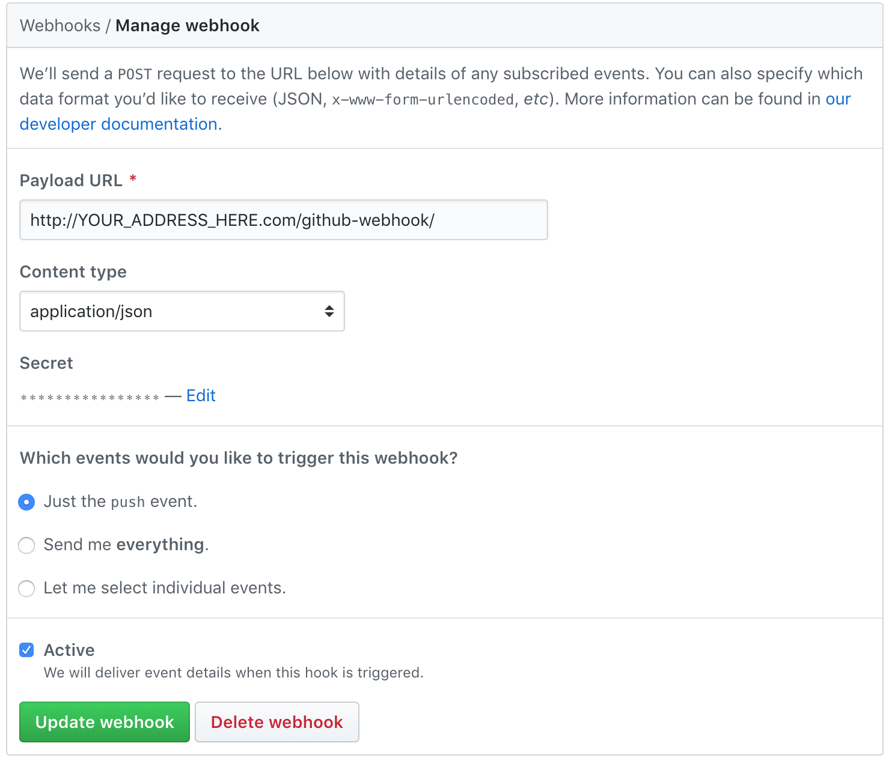
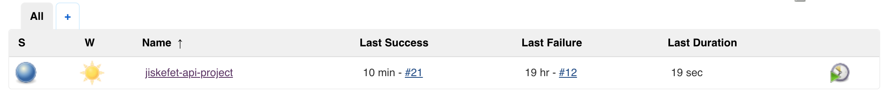
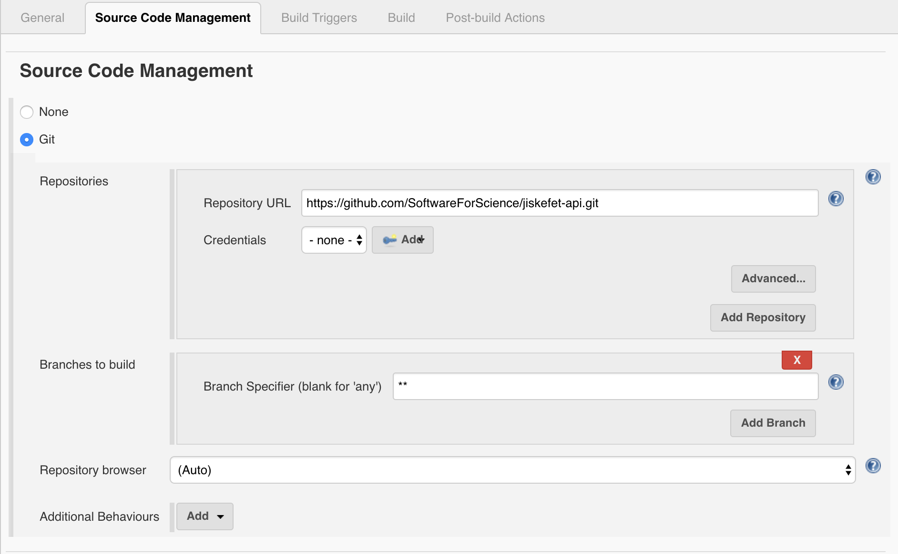
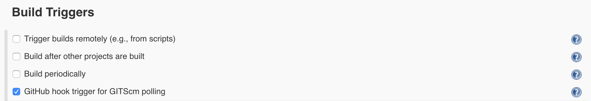
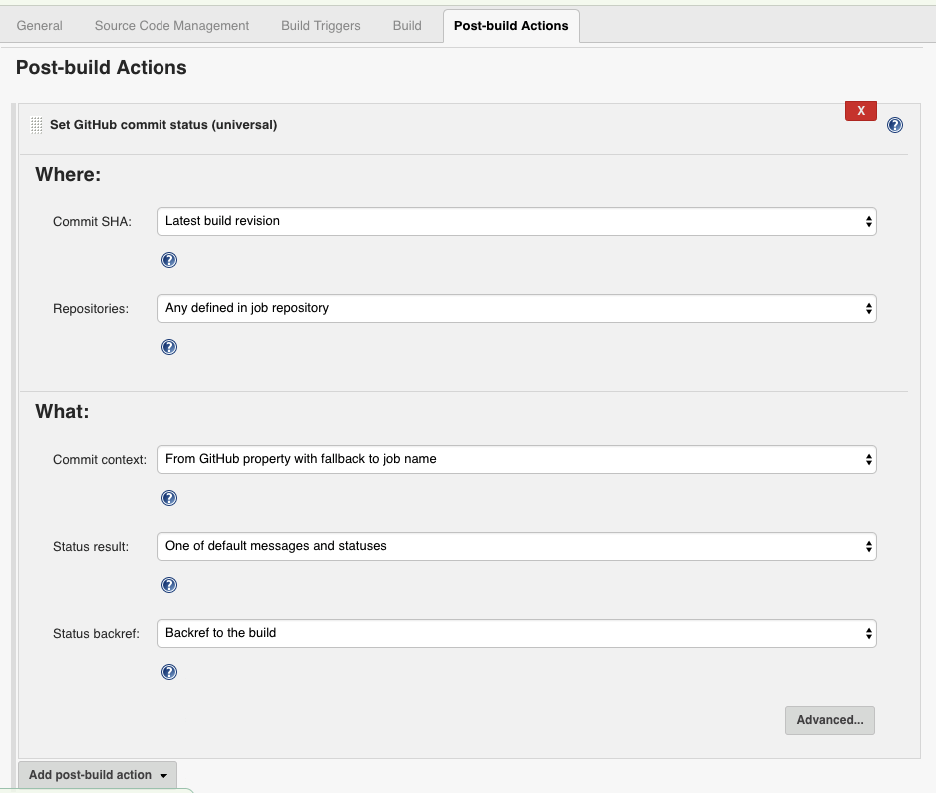
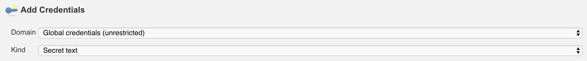
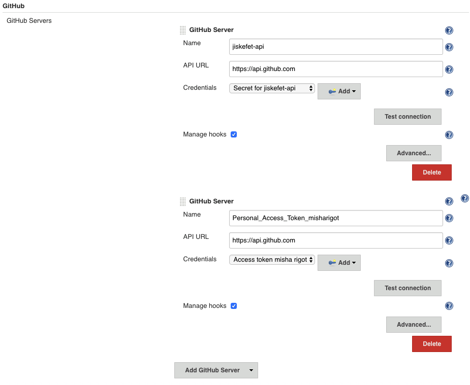

# Continuous Integration (CI) with Jenkins
The current folder (`/ci`) contains a separate playbook for setting up a Jenkins CI server. The server will have the following things:
- Jenkins (behind an nginx reverse proxy).
- MySQL database for running tests against.
  
**Note:** there is currently no support for running both this CI playbook and the base playbook against the same host(s).

[To table of contents in README.md](../README.md#table-of-contents)


# Table of contents

1. [Deploy](#Deploy)
2. [Workflow](#Workflow)
3. [Webhooks and repo status in Github](#Webhooks-and-repo-status-in-GitHub)

## Deploy
The following section describes the steps required to deploy Jenkins on a remote server.

- Make sure you are in the `ci` directory.

  ```bash
  $ cd ci
  ```
- Set your hosts in the `hosts` file and make sure you can [connect to the servers via ssh](../docs/setting_up_ssh.md).
- Copy the `variables.yml.dist` as `variables.yml`. Change the variables to the appropriate values where needed. [More info on these variables](roles/geerlingguy.jenkins/README.md).
- Run playbook.

  ```bash
  $ ansible-playbook site.yml
  ```
- Open a browser and navigate to http://SERVER_ADDRESS to go to the Jenkins dashboard.
- Configure jenkins and jobs individually where needed (e.g. setup webhooks). 
  
**Note for running tests:**   
To be able to run `npm run test` for end-to-end tests in the jiskefet-api, a `.env` should contain the credentials to connect to the test database that is created by this playbook.

`.env` needs to be manually created on the server via ssh. The project is located in either `/var/lib/jenkins/jobs/<project_name>/workspace` (or `/var/lib/jenkins/workspace/<project_name>`). 

You can copy the staging env for this:  
```bash
$ cp PATH_TO_PROJECT/<project_name>/environments/staging.env.template .env
```

And then change the test db variables and the JWT secret, which are required for running tests against the db with authenticated API calls.

[Back to table of contents](#Table-of-contents)


## Workflow
The following section describes the workflow for creating new jobs and integrating them into this playbook repo.

The Jenkins GUI makes it easy to configure jobs. When jobs are configured the way you want, you will want to incorporate your changes into this repository. In order to do so, you only need to copy the contents of the `jobs` directory from the environment where you configured the jobs at, into the `ci/files/jobs` directory in this repository.

The general workflow for creating jobs:

1. Create/edit/delete jobs via the Jenkins GUI.
2. Copy the contents of `<your_jenkins_path>/jobs` into this repo's dir `ci/files/jobs`.
    
    **Example**  
    ```bash
    # When Jenkins runs remotely
    # scp -r <HOST_ALIAS>:<PATH_ON_HOST> <LOCAL_PATH_TO_PROJECT>/ci/files
    $ scp -r jiskefet-ci:/var/lib/jenkins/jobs ~/projects/jiskefet-deploy/ci/files

    # When Jenkins runs locally
    $ cp -r /Users/Bob/.jenkins/jobs ~/projects/jiskefet-deploy/ci/files
    ```
**WARNING**: Make sure to remove workspaces to ensure that `.env` variables are not being pushed by accident to GitHub. Workspaces exist in `jobs/<jobname>/workspace`.

[Back to table of contents](#Table-of-contents)

## Webhooks and repo status in GitHub
The following section describes steps to ensure that Jenkins automatically builds a project when a change is pushed to GitHub and to make Jenkins push build status updates to GitHub.

Settings that need to be configured:  
(more info on the GitHub plugin for Jenkins can be found [here](https://wiki.jenkins.io/display/JENKINS/GitHub+Plugin))

### GitHub Webhook
Create a webhook in GitHub with the following settings:


The payload URL is the address to your Jenkins web UI.

### Project
The following settings need to be set in your Jenkins project.
Projects are displayed in the root of your web UI and look like this:


#### Git settings
Project settings for the Jenkins plugin named 'Git plugin'.


#### GitHub settings
Project settings for the Jenkins plugin named 'GitHub plugin'.




### Global settings
These are the global settings in `Manage Jenkins > Configure System`. These 'GitHub Servers' are used to make authenticated HTTP requests between the Jenkins server and GitHub.

Both servers use the credential option 'Secret text' under the field 'Kind'.


The first server uses the same webhook secret as defined in your webhook in GitHub.  
The second server uses a 'Personal access token' from GitHub as a secret. Such a token can be made at https://github.com/settings/tokens and in this case is bound to a GitHub user.


[Back to table of contents](#Table-of-contents)
